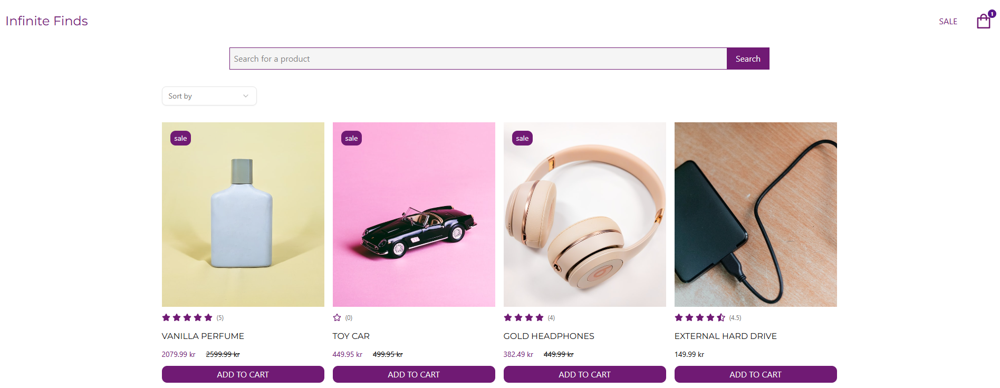

<a name="readme-top"></a>

#### FED2 JavaScript Frameworks CA - Online Shop
##### Delivery: March 2025

<div align="center">

 <a href="https://infinitefinds.netlify.app/">
    
  </a>
  
  <br>
<p align="center">
 
<a href="https://www.figma.com/design/YbtSJJbgrvVB3hfBbkhTpP/eCom?node-id=0-1&t=wuaRkZiOe5iHs9un-1">Figma Design File</a>
    ·
<a href="https://infinitefinds.netlify.app/">Visit the Website</a>
</p>
  
</div>


## Built With


## About The Project

This is a website for the fictional online shop Infinite Finds. Brows through diverse product, add to cart and checkout. 

The goal of this course assignment is to use React to build the website. 

API documentation used on the project:
The API can be found in the [Noroff API documentation](https://docs.noroff.dev/docs/v2/basic/online-shop)

## Contact
Feel free to contact me

Eli Nygård 

[](mailto:eli.nygard@gmail.com)
[](https://www.linkedin.com/in/eli-nygard)

## Getting Started

### Prerequisites

Make sure you have Git installed on your local machine. You can download it from [here](https://git-scm.com/downloads)

### Installation

Clone the repo:

```sh
git clone https://github.com/EliNygard/fed2-jsframeworks-ca.git
```

### Open the project

Navigate to the project directory:

```sh
cd fed2-jsframeworks-ca
```

Open the project with VSCode:

```sh
code .
```

Run npm install to install the necessary dependencies:

```sh
npm install
```

